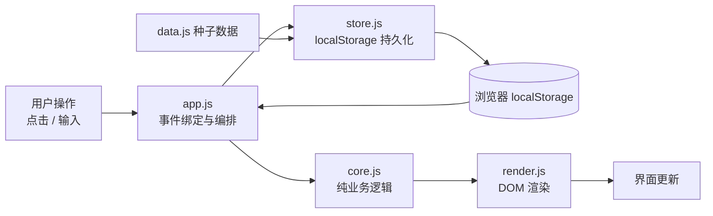
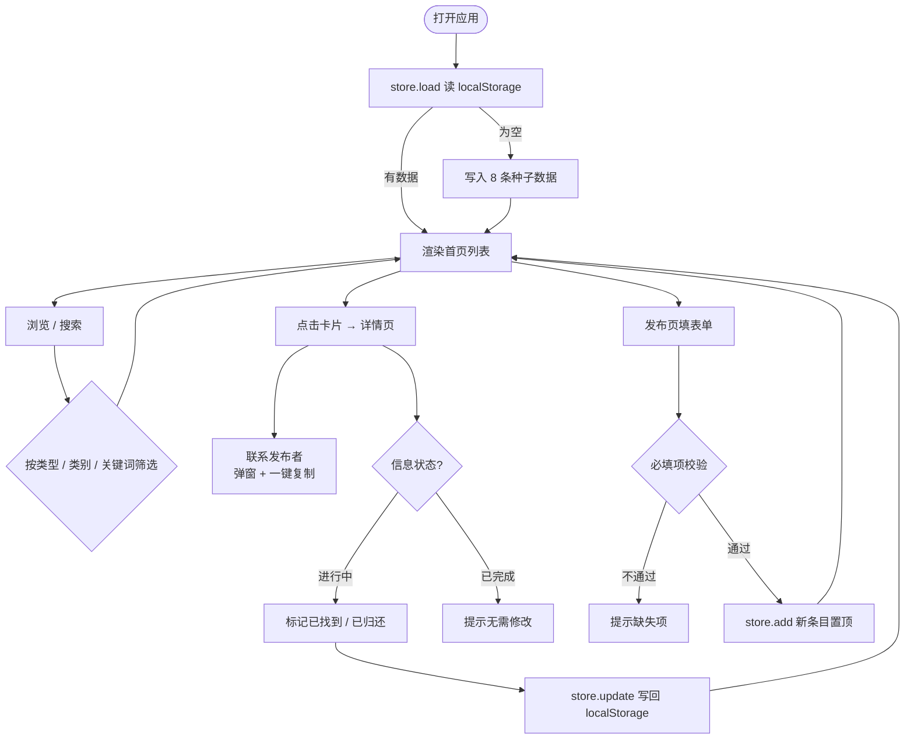
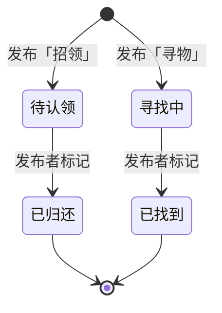

# 校园失物招领 · 关键流程与数据流图

## 一、系统分层与数据流

- **core.js**：只做数据运算（搜索、筛选、状态机、校验、格式化），不碰 DOM 和存储，因此可被 Node 直接 `require` 做单元测试。
- **store.js**：唯一读写 localStorage 的地方，负责「首次写入种子数据、增改、持久化」。
- **render.js**：把数据变成 HTML，插入 DOM 前统一做 HTML 转义（防 XSS）。
- **app.js**：持有全局状态 `State`，接收用户事件、调用 core/store/render 完成一次交互。

## 二、核心业务流程图

## 三、状态机

- 「招领」信息的完成态是 **已归还**，「寻物」信息的完成态是 **已找到**；
- 已完成状态不可再回退，标记后首页 / 详情 / 我的发布三处同步刷新。

## 四、核心函数说明

| 函数 | 所属文件 | 作用 |
| --- | --- | --- |
| `searchItems(items, kw)` | core.js | 名称/类别/地点/描述 多字段模糊匹配 |
| `filterByType / filterByStatus` | core.js | 类型（招领/寻物）、状态（进行中/已完成）筛选 |
| `markDoneStatus(item)` | core.js | 状态机转移，非法转移返回 `null` |
| `validateItem(fields)` | core.js | 名称/地点/联系方式必填校验 |
| `relativeTime(iso, now)` | core.js | ISO 时间 → 「刚刚 / n 分钟前」 |
| `Store.load / add / update` | store.js | 数据读写与持久化 |
| `Render.renderHome / renderDetail / renderMine` | render.js | 各页面 DOM 渲染 |
